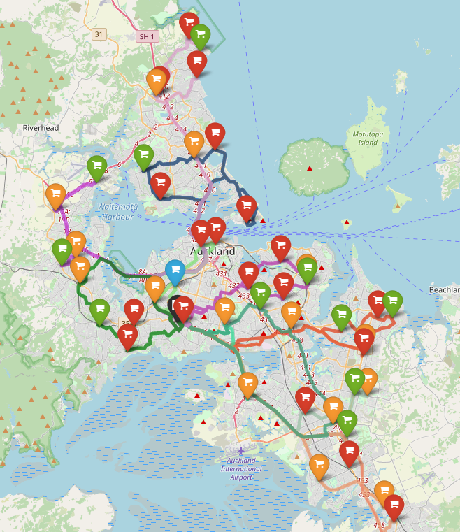

# Optimal Supermarket Stocking

A vehicle routing problem solved utilising a genetic algorithm based TSP solver. Required analysis of existing demand data to determine likely daily demands at nodes. Using the OpenStreetMaps API real-world distance and road data was used when solving, Foliage was used to visualise the routes. Monte Carlo Simulation was used to estimate chances that additional routing would be required.

## Files and Folders
* routes1 and routes2
	* Foliage visualisations of the weekday and weekend routes
* Plots
	* Contains Monte Carlo Simulation plots, Matplotlib visualisations 	  of the routes and terminal output giving the route information 	  (nodes and route weights)
* src
	* Contains all Python code related to the modelling, solving and 	  simulation. Also contains an R script used to analyse the demand   	  data
* src/data
	* Contains node demand data and R analysis as csvs 

